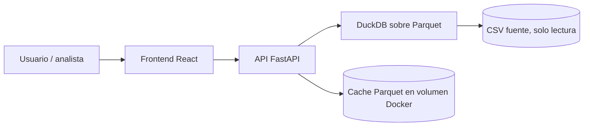

# Buscador de Tarifas del Registro Público de Telecomunicaciones

Herramienta oficial para la consulta, búsqueda y comparación de tarifas y promociones registradas en el **Registro Público de Telecomunicaciones**, desarrollada para la **Comisión Reguladora de Telecomunicaciones (CRT)**, órgano adscrito a la Agencia de Transformación Digital y Telecomunicaciones (ATDT).

Este proyecto es la renovación del antiguo visor de tarifas del IFT (`tarifas.ift.org.mx`). Permite a usuarios finales, analistas y concesionarios navegar el catálogo completo de tarifas registradas — **Servicios Móviles, Servicios Fijos, Televisión Restringida y Otros Servicios de Telecomunicaciones** — con filtros avanzados, comparador de planes y exportación de datos.

> Este README documenta el arranque técnico del proyecto. El detalle de alcance, cronograma y gestión vive en el reporte de proyecto (Word) entregado junto con este documento.

---

## Tabla de contenido
- [Stack tecnológico](#stack-tecnológico)
- [Arquitectura](#arquitectura)
- [Requisitos](#requisitos)
- [Levantar el proyecto](#levantar-el-proyecto)
- [Variables de entorno](#variables-de-entorno)
- [Estructura del repositorio](#estructura-del-repositorio)
- [Endpoints del API](#endpoints-del-api)
- [Flujo de trabajo en equipo](#flujo-de-trabajo-en-equipo)
- [Calidad de código](#calidad-de-código)
- [Pruebas](#pruebas)
- [CI/CD](#cicd)
- [Accesibilidad y cumplimiento](#accesibilidad-y-cumplimiento)
- [Roadmap](#roadmap)

---

## Stack tecnológico

Se conserva y se justifica el stack validado en el prototipo anterior, porque ya demostró ser adecuado para un catálogo de miles de registros con consultas en milisegundos. Se añaden herramientas orientadas a trabajo colaborativo y calidad continua.

| Capa | Herramienta | Por qué |
|---|---|---|
| Frontend | React + Vite + TypeScript | Tipado estático reduce errores en un equipo de varias manos |
| Estilos | Tailwind CSS | Consistencia visual sin CSS disperso entre desarrolladores |
| Estado / datos remotos | TanStack Query | Cache y sincronización de peticiones al API sin lógica manual duplicada |
| Tablas grandes | TanStack Table + TanStack Virtual | Virtualización de filas para listados de miles de tarifas |
| Backend | FastAPI (Python) | Tipado con Pydantic, documentación OpenAPI automática (`/docs`) |
| Procesamiento de datos | Polars + DuckDB | Consultas analíticas en memoria sobre archivos Parquet, sin necesidad de un motor de base de datos pesado |
| Caché de datos | Parquet (volumen Docker) | Lecturas rápidas repetidas sin tocar el CSV fuente |
| Infraestructura | Docker + Docker Compose | Entorno idéntico para todo el equipo y para CRT/TI en producción |
| CI | GitHub Actions | Lint y pruebas obligatorias antes de fusionar a `main` |
| Linters/formato | Ruff, Black, mypy (backend) · ESLint, Prettier (frontend) | Estilo uniforme, revisado automáticamente, no por criterio de cada persona |
| Pruebas | Pytest (backend) · Vitest + Testing Library (frontend) · Playwright (E2E) | Cobertura funcional y de flujo real de usuario |
| Accesibilidad | axe-core (CI) | Obligatorio por tratarse de un sitio de gobierno (WCAG 2.1 AA) |

## Arquitectura



## Requisitos
- Docker Desktop con Docker Compose
- Git
- Node.js 20+ y Python 3.11+ (solo si se desarrolla fuera de Docker)

## Levantar el proyecto

```bash
git clone <url-del-repositorio>
cd buscador-tarifas
cp .env.example .env
docker compose up --build
```

Aplicaciones disponibles:
- Frontend: http://localhost:5173
- API docs: http://localhost:8000/docs
- Health: http://localhost:8000/health

## Variables de entorno

Copiar `.env.example` a `.env` y ajustar según el entorno local. Nunca subir `.env` real al repositorio.

```env
CSV_SOURCE_PATH=./data/tarifas.csv
PARQUET_CACHE_DIR=./data/parquet_cache
API_PORT=8000
FRONTEND_PORT=5173
CORS_ORIGINS=http://localhost:5173
```

## Estructura del repositorio

```
├── backend/          # FastAPI, capa de datos (Polars/DuckDB), pruebas pytest
├── frontend/          # React + Vite + Tailwind, pruebas Vitest
├── e2e/                # Pruebas Playwright de extremo a extremo
├── data/               # CSV fuente (solo lectura) y cache Parquet
├── .github/workflows/  # Pipelines de CI
├── docker-compose.yml
├── .env.example
└── README.md
```

## Endpoints del API

- `GET /health`
- `GET /api/v1/filters`
- `GET /api/v1/search`
- `GET /api/v1/top10`
- `GET /api/v1/products/{id_tarifa}`

## Flujo de trabajo en equipo

**Ramas**
- `main`: producción, protegida, solo se fusiona vía Pull Request aprobado.
- `develop`: integración de features antes de release.
- `feature/<nombre-corto>`, `fix/<nombre-corto>`, `release/<version>`.

**Commits**: usar [Conventional Commits](https://www.conventionalcommits.org/) (`feat:`, `fix:`, `docs:`, `test:`, `refactor:`) para que el historial y el changelog se puedan generar automáticamente.

**Pull Requests**
- Mínimo 1 revisión aprobada antes de fusionar.
- CI en verde (lint + pruebas) obligatorio.
- Usar la plantilla de PR (`.github/PULL_REQUEST_TEMPLATE.md`) describiendo qué cambia y cómo se probó.

**Reparto sugerido de áreas** (ajustar a las personas del equipo):
| Área | Responsabilidad |
|---|---|
| Frontend/UX | Componentes, accesibilidad, diseño responsivo |
| Backend/Datos | API, normalización de datos, rendimiento de consultas |
| QA/Accesibilidad | Pruebas automatizadas, pruebas manuales, WCAG |
| DevOps | Docker, CI/CD, entornos, despliegue |

## Calidad de código

- Pre-commit hooks: `husky` + `lint-staged` (frontend), `pre-commit` framework con `ruff`/`black` (backend).
- Ejecutar antes de cada commit: linters corren automáticamente; si fallan, el commit se bloquea.

## Pruebas

```bash
# Backend
cd backend && ..\.venv\Scripts\python.exe -m pytest -q

# Frontend
cd frontend && npm test

# Smoke test en Docker
docker compose exec api python -m pytest -q

# E2E
cd e2e && npx playwright test
```

## CI/CD

GitHub Actions ejecuta en cada Pull Request:
1. Lint (Ruff/ESLint)
2. Pruebas unitarias (backend y frontend)
3. Prueba de accesibilidad automatizada (axe-core)
4. Build de imágenes Docker (validación, sin publicar)

## Accesibilidad y cumplimiento

Por ser una herramienta de un organismo público, el sitio debe cumplir WCAG 2.1 nivel AA: contraste de color, navegación por teclado, compatibilidad con lectores de pantalla y estructura semántica correcta. Estas validaciones se integran en CI, no se dejan como revisión manual al final.

## Roadmap

- [ ] Migración completa de datos históricos del RPC y el SNII.
- [ ] Comparador de tarifas entre concesionarios (no solo por servicio móvil).
- [ ] Exportación de resultados a CSV/Excel desde la interfaz.
- [ ] API pública documentada para consumo externo (open data).
- [ ] Panel de administración para carga de nuevas tarifas por concesionarios autorizados.
