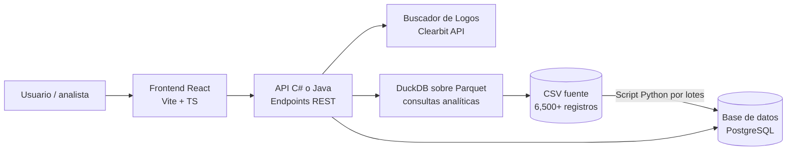

# Buscador de Tarifas del Registro Público de Telecomunicaciones

Herramienta oficial para la consulta, búsqueda y comparación de tarifas y promociones registradas en el **Registro Público de Telecomunicaciones**, desarrollada para la **Comisión Reguladora de Telecomunicaciones (CRT)**, órgano adscrito a la Agencia de Transformación Digital y Telecomunicaciones (ATDT).

Este proyecto es la renovación del antiguo visor de tarifas del IFT (`tarifas.ift.org.mx`). Permite a usuarios finales, analistas y concesionarios navegar el catálogo completo de tarifas registradas — **Servicios Móviles, Servicios Fijos, Televisión Restringida y Otros Servicios de Telecomunicaciones** — con filtros avanzados, comparador de planes, buscador de logos de operadores y exportación de datos.

> Este README documenta el arranque técnico del proyecto. El detalle de alcance, cronograma y gestión vive en el reporte de proyecto entregado junto con este documento.

---

## Tabla de contenido
- [Stack tecnológico](#stack-tecnológico)
- [Arquitectura](#arquitectura)
- [Herramientas similares en el mundo](#herramientas-similares-en-el-mundo)
- [Prototipos de diseño](#prototipos-de-diseño)
- [Buscador de logos de operadores](#buscador-de-logos-de-operadores)
- [Requisitos](#requisitos)
- [Levantar el proyecto](#levantar-el-proyecto)
- [Variables de entorno](#variables-de-entorno)
- [Estructura del repositorio](#estructura-del-repositorio)
- [Endpoints del API](#endpoints-del-api)
- [Flujo de trabajo en equipo](#flujo-de-trabajo-en-equipo)
- [Calidad de código](#calidad-de-código)
- [Pruebas](#pruebas)
- [CI/CD](#cicd)
- [Accesibilidad y cumplimiento](#accesibilidad-y-cumplimiento)
- [Roadmap](#roadmap)
- [Evidencia](#evidencia)

---

## Stack tecnológico

Se conserva y amplía el stack validado en el prototipo anterior, con herramientas orientadas a trabajo colaborativo, calidad continua e infraestructura RedHat/Podman.

| Capa | Herramienta | Por qué |
|---|---|---|
| Frontend | React + Vite + TypeScript | Tipado estático reduce errores en un equipo de varias manos |
| Estilos | Tailwind CSS | Consistencia visual sin CSS disperso entre desarrolladores |
| Estado / datos remotos | TanStack Query | Cache y sincronización de peticiones al API sin lógica manual duplicada |
| Tablas grandes | TanStack Table + TanStack Virtual | Virtualización de filas para listados de miles de tarifas |
| Backend | C# (.NET) o Java (Spring Boot) | Entorno empresarial compatible con infraestructura ATDT, tipado fuerte, soporte RedHat |
| Script de datos | Python + Polars | Lectura por lotes del CSV e inserción a base de datos de desarrollo |
| Procesamiento analítico | DuckDB + Parquet | Consultas analíticas en memoria sin motor de BD pesado |
| Base de datos | PostgreSQL (desarrollo) / Oracle o SQL Server (producción) | Persistencia de tarifas con soporte para búsqueda full-text |
| Buscador de logos | Python (Clearbit API + fallback) | Resolución automática de logos por nombre de operador desde el CSV |
| Infraestructura | Podman + Docker Compose | Entorno idéntico para el equipo y compatible con RedHat Enterprise Linux |
| CI | GitHub Actions | Lint y pruebas obligatorias antes de fusionar a `main` |
| Linters/formato | Ruff, Black, mypy (Python) · ESLint, Prettier (frontend) | Estilo uniforme, revisado automáticamente |
| Pruebas | Pytest (Python) · xUnit/.NET Test (backend) · Vitest + Testing Library (frontend) · Playwright (E2E) | Cobertura funcional y de flujo real de usuario |
| Accesibilidad | axe-core (CI) | Obligatorio por tratarse de un sitio de gobierno (WCAG 2.1 AA) |

---

## Arquitectura



---

## Herramientas similares en el mundo

> Extracto del benchmarking internacional realizado para este proyecto.

A continuación se listan los comparadores de tarifas de telecomunicaciones más relevantes a nivel global, que sirven como referencia de diseño, arquitectura y modelo de negocio para este buscador:

| Herramienta | País / Región | Tipo | URL | Destacado |
|---|---|---|---|---|
| **Visor de Tarifas IFT** | México | Gobierno | [tarifas.ift.org.mx](https://tarifas.ift.org.mx) | Sistema SERT. Fuente directa del CSV que usamos. Base de datos completa del RPC. |
| **Comparador IFT (Planes Móviles)** | México | Gobierno | [ift.org.mx/usuarios-telefonia-movil](https://www.ift.org.mx/usuarios-telefonia-movil/comparador-de-planes-de-telefonia-movil) | 560,195 consultas desde su lanzamiento hasta dic-2020. Ganador premio UIT. |
| **Checa tu plan – OSIPTEL** | Perú | Gobierno | [checatuplan.pe](https://www.checatuplan.pe/) | 3.5 millones de visitas acumuladas. Referente de UX gubernamental en LATAM. |
| **Comparador CRC** | Colombia | Gobierno | [comparador.crcom.gov.co](https://comparador.crcom.gov.co/) | Web scraping automatizado diario. 5,902+ planes. Exime responsabilidad al operador. |
| **CNMC Comparador Energía** | España | Gobierno | [comparador.cnmc.gob.es](https://comparador.cnmc.gob.es/) | Modelo de neutralidad absoluta. Sin afiliación. Referente europeo. |
| **Rastreator** | España / México | Privado | [rastreator.com](https://www.rastreator.com/tarifas-movil.aspx) | 30+ operadoras en tiempo real. Modelo de afiliación (lead generation). Ahorro promedio 104€. |
| **Kelisto** | España | Privado | [kelisto.es](https://www.kelisto.es/telefonia-movil/) | Comparativa + ranking cualitativo de atención al cliente. |
| **WhistleOut** | EE. UU. / Australia | Privado | [whistleout.com](https://www.whistleout.com/) | 3M usuarios/mes (EE.UU.), 7M usuarios/año (Australia). 39 operadores. Big Data de hábitos. |
| **Quién es Quién en los Precios** | México | Gobierno (PROFECO) | [qqp.profeco.gob.mx](https://qqp.profeco.gob.mx/) | Historial desde 1977. Incluye telefonía celular y equipos. Integrado con Buen Fin. |
| **Comparador Contratos de Adhesión** | México | Gobierno (IFT+PROFECO) | [gob.mx/profeco](https://www.gob.mx/profeco/articulos/comparador-de-contratos-de-adhesion-de-telecomunicaciones) | Compara penalidades, garantías y plazos forzosos de los contratos. |

> **Conclusión del benchmarking:** La herramienta más exitosa combina un backend de datos riguroso (como el SERT del IFT) con una capa de UX orientada al lenguaje cotidiano del usuario (como OSIPTEL con "Checa tu plan"). Nuestro buscador apunta a ese modelo híbrido.

---

## Prototipos de diseño

Los siguientes prototipos fueron generados con IA como punto de partida para la maquetación del equipo de Frontend.

### Tablero comparativo de variantes — Cuestionario, Grid, Simulador y Trazabilidad


*Mosaico con cuatro variantes conceptuales del flujo de búsqueda: cuestionario guiado estilo OSIPTEL (V1), grid visual de tarjetas con filtro directo (V2), simulador de consumo real de datos (V3) y vista simplificada con trazabilidad del registro oficial (V4).*

### Mockups de landing page — Calculadora, Ahorro, Portal Oficial y Transparencia en Tiempo Real


*Cuatro propuestas de página principal: calculadora de consumo con planes ideales, buscador enfocado en ahorro y claridad, portal de acceso a información oficial del registro público, y panel de transparencia con tendencias de precio en tiempo real.*

### Mockups por módulo funcional — Cuestionario (A), Resultados (B), Comparador (C) y Observatorio Regulatorio (E)

.jpeg)

*Cuatro pantallas independientes por módulo: cuestionario de búsqueda guiada (Módulo A), grid de resultados con sliders de filtro (Módulo B), comparador lado a lado de planes (Módulo C) y dashboard del Observatorio Regulatorio con indicadores de calidad de datos (Módulo E).*

### Wireframes de flujo completo — Landing (A), Resultados explicables (B), Comparación (C) y Búsqueda avanzada (D)

.jpeg)

*Cuatro pantallas del flujo completo etiquetadas como Versión 1 a 4: landing guiado "Encuentra tu plan ideal" (Módulo A), página de resultados con justificación de recomendación (Módulo B), pantalla de comparación detallada (Módulo C) y búsqueda avanzada para especialistas (Módulo D).*
---

## Buscador de logos de operadores

Una de las nuevas funcionalidades de esta versión es la resolución automática de logos a partir del nombre del operador en el CSV.

### ¿Cómo funciona?

El script [`logos.py`](logos.py) lee la columna `OPERADOR_NOMBRE` del CSV fuente, mapea los nombres a dominios web conocidos y descarga los logos vía la API de Clearbit Logo:

```
https://logo.clearbit.com/{dominio}
```

### Operadores soportados (mapa inicial)

| Operador en CSV | Dominio para logo |
|---|---|
| TELCEL | telcel.com |
| MOVISTAR | movistar.com.mx |
| AT&T | att.com.mx |
| VIRGIN MOBILE | virginmobile.mx |

> **Próximos pasos:** El backend expondrá el endpoint `GET /api/v1/logos/{operador}` que devolverá la URL del logo resolviendo automáticamente el dominio, con fallback a un logo genérico si no se encuentra.

### Ejecutar el buscador de logos standalone

```bash
# Requiere: pip install pandas requests pillow matplotlib
python logos.py
```

---

## Datos fuente

- **CSV principal:** `05_tarifas_servicios_moviles_febrero26_gustavo.csv` (~100 MB, 6,500+ registros)
- Columnas clave: `ID_TARIFA`, `OPERADOR_NOMBRE`, `NOMBRE_PLAN`, `PRECIO_MENSUAL`, `DATOS_GB`, `MINUTOS`, `VIGENCIA_INICIO`, `VIGENCIA_FIN`

---

## Requisitos

- Podman o Docker Desktop con Docker Compose
- Git
- Node.js 20+ (solo si se desarrolla frontend fuera de contenedor)
- Python 3.11+ (solo para el script de datos)
- .NET 8+ o JDK 21+ (solo si se desarrolla backend fuera de contenedor)

---

## Levantar el proyecto

```bash
git clone <url-del-repositorio>
cd buscador-tarifas
cp .env.example .env
docker compose up --build
# o con Podman:
podman-compose up --build
```

Aplicaciones disponibles:
- **Frontend:** http://localhost:5173
- **API docs (Swagger):** http://localhost:8080/swagger
- **Health:** http://localhost:8080/health

---

## Variables de entorno

Copiar `.env.example` a `.env` y ajustar según el entorno local. Nunca subir `.env` real al repositorio.

```env
CSV_SOURCE_PATH=./data/05_tarifas_servicios_moviles_febrero26_gustavo.csv
PARQUET_CACHE_DIR=./data/parquet_cache
DB_CONNECTION_STRING=Host=localhost;Port=5432;Database=tarifas_dev;Username=dev;Password=dev
API_PORT=8080
FRONTEND_PORT=5173
CORS_ORIGINS=http://localhost:5173
CLEARBIT_LOGO_BASE_URL=https://logo.clearbit.com
```

---

## Estructura del repositorio

```
├── backend/              # C# (.NET) o Java (Spring Boot)
│   ├── src/
│   ├── tests/
│   └── Dockerfile
├── frontend/             # React + Vite + Tailwind, pruebas Vitest
│   ├── src/
│   └── Dockerfile
├── data-scripts/         # Python: lectura CSV por lotes e inserción a BD
│   ├── ingest_csv.py
│   └── logos.py
├── e2e/                  # Pruebas Playwright de extremo a extremo
├── data/                 # CSV fuente (solo lectura) y cache Parquet
├── Prototipos/           # Prototipos de diseño IA
├── .github/workflows/    # Pipelines de CI
├── docker-compose.yml
├── podman-compose.yml
├── .env.example
└── README.md
```

---

## Endpoints del API

| Método | Endpoint | Descripción |
|---|---|---|
| `GET` | `/health` | Estado del servicio |
| `GET` | `/api/v1/filters` | Opciones de filtros disponibles (operadores, rangos) |
| `GET` | `/api/v1/search` | Búsqueda paginada con filtros |
| `GET` | `/api/v1/top10` | Top 10 planes por criterio |
| `GET` | `/api/v1/products/{id_tarifa}` | Detalle de una tarifa específica |
| `GET` | `/api/v1/logos/{operador}` | URL del logo del operador (Clearbit + fallback) |
| `GET` | `/api/v1/export` | Exportar resultados filtrados a CSV/Excel |

---

## Flujo de trabajo en equipo

### Ramas
- `main`: producción, protegida, solo se fusiona vía Pull Request aprobado.
- `develop`: integración de features antes de release.
- `feature/<nombre-corto>`, `fix/<nombre-corto>`, `release/<version>`.

### Commits
Usar [Conventional Commits](https://www.conventionalcommits.org/) (`feat:`, `fix:`, `docs:`, `test:`, `refactor:`) para que el historial y el changelog se generen automáticamente.

### Pull Requests
- Mínimo 1 revisión aprobada antes de fusionar.
- CI en verde (lint + pruebas) obligatorio.
- Describir qué cambia y cómo se probó.

### Reparto de áreas

| Rol | Responsabilidad |
|---|---|
| **Ingeniero A — Datos** | Script Python para leer CSV por lotes e insertar en BD de desarrollo |
| **Ingeniero B — Backend** | API C# o Java, conexión a BD, endpoints (inicialmente con mocks) |
| **Ingeniero C — Frontend** | Maquetación del buscador y filtros, consumiendo JSON mock del Ing. B |
| **DevOps — Infraestructura** | Contenedores Podman/Docker, configuración para servidor RedHat |

---

## Calidad de código

- Pre-commit hooks: `husky` + `lint-staged` (frontend), `pre-commit` framework con `ruff`/`black` (Python).
- Ejecutar antes de cada commit: linters corren automáticamente; si fallan, el commit se bloquea.

---

## Pruebas

```bash
# Python (data scripts)
cd data-scripts && python -m pytest -q

# Backend C#
cd backend && dotnet test

# Frontend
cd frontend && npm test

# Smoke test en Docker
docker compose exec api dotnet test  # o mvn test para Java

# E2E
cd e2e && npx playwright test
```

---

## CI/CD

GitHub Actions ejecuta en cada Pull Request:
1. Lint (Ruff/ESLint)
2. Pruebas unitarias (Python, backend, frontend)
3. Prueba de accesibilidad automatizada (axe-core)
4. Build de imágenes Docker/Podman (validación, sin publicar)

---

## Accesibilidad y cumplimiento

Por ser una herramienta de un organismo público, el sitio debe cumplir **WCAG 2.1 nivel AA**: contraste de color, navegación por teclado, compatibilidad con lectores de pantalla y estructura semántica correcta. Estas validaciones se integran en CI.

---

## Roadmap

- [ ] Script de ingesta CSV → BD (Ingeniero A, semana 1)
- [ ] Endpoints mock del API (Ingeniero B, semana 1)
- [ ] Maquetación del buscador y filtros (Ingeniero C, semana 1)
- [ ] Contenedores Podman + config RedHat (DevOps, semana 1)
- [ ] Buscador de logos completo con fallback (semana 2)
- [ ] Integración frontend ↔ backend real (semana 2)
- [ ] Exportación de resultados a CSV/Excel desde la interfaz
- [ ] Migración completa de datos históricos del RPC y el SNII
- [ ] Comparador de tarifas entre concesionarios (todos los servicios)
- [ ] API pública documentada para consumo externo (open data)
- [ ] Panel de administración para carga de nuevas tarifas

---

## Evidencia — Prototipo anterior

Capturas de pantalla del funcionamiento del prototipo previo (FastAPI + React):


